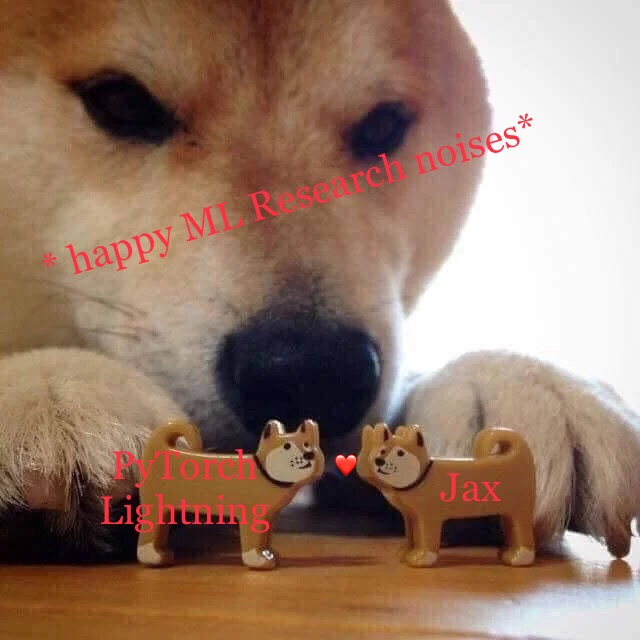

# JaxLightning
PyTorch Lightning + Jax = nice

# PyTorch Lightning

The package has become the go-to standard of ML research for PyTorch.
Above all, it removes all the boiler plate code that you usually have to write for kicking off a simple experiment.
Additionally, you got amazing logging, general code structure, data management via LightningDataModules and other templates making quick iteration a breeze.

# Jax

Recent packages such as Equinox and Treex are at the top level very similar in structure and handling like PyTorch.
This makes the code very readable and succinct.
The biggest advantage of Jax is probably its clean functional programming (I've come around to that) and its speed.
Vmap, derivatives in all directions and automatic accelerator management (no more tensor.to(deviceXYZ)) is also part of the gift box.

You can find a speed comparison at the deep learning course of [UvA](https://uvadlc-notebooks.readthedocs.io/en/latest/tutorial_notebooks/JAX/tutorial5/Inception_ResNet_DenseNet.html).
The take away of that PyTorch vs Jax comparison is that Jax excels at compiling forward and backward passes consisting of lots of SIMD (single instruction multiple data) instructions such as separate calls of small-ish kernel convolutions on locally independent data.
The speed-up can be considerable at **2.5X-3.4X** but is expected to regress to PyTorchs performance to drop once the time spend on executing those calls increases relative to the function call itself.
That means that for large batch sizes, single instructions on very large tensors will depend on the hardware and the XLA compiler can do little about that.

# Can we get the best of both worlds? Yes, we can[1].

References: [1] Obama

You can run any Jax code and thus any Jax neural network package inside of PyTorch Lightning, be it written in Flax/Haiku/Equinox/Treex and optimized with the common optimization libraries. 

### Tensors vs Arrays

The main idea of combining the great and convenient code structure of PyTorch Lightning with the versatility of Jax is to restrict PyTorch Lightning to pure Numpy/Jax.Numpy until the data 'reaches' the Jax model.
Therefore we can reuse almost all DataModules and DataSets and remove the single line, where data is cast to torch.Tensors.
Thus the dataloader/datamodules etc restricted to Numpy/Jax.Numpy operations.

### Optimization

Secondly, we can't use PyTorch Lightning automatic optimization which makes setting up experiments in PL so convenient.
But at the same time Jax does automatic device placement and moving tensors to the correct devices.
Thus by simply setting the class variable `automatic_optimization=False` we gain complete control over all gradient computations and gradient descent optimization and tell PL that we'll do our optimization on our own.

Since Jax requires pure functions, all we have to do is make the forward step a `@staticmethod` without the `self` argument.
Similarly, we can create a static gradient function in the same way.

Question: What do we gain?

Answer: We can jit-compile the entire forward and backward pass with **JAX** with a simple decorator inside the training setup of **Pytorch Lightning**.

Thus PyTorch Lightning takes care of all the data set management, the logging, the tracking and the overall training loop structure with all the convenience PL is famous for, and Jax does the fast computing inside of PL.

Everybody wins ...

### Examples

There are two examples how I used PyTorch Lightning for Bayesian Neural Networks and Score Based Generative Modelling ([used code by Patrick Kidger](https://docs.kidger.site/equinox/examples/score_based_diffusion/)).
The score based generative modelling was copied from the amazing code base of [Patrick Kidger](https://github.com/patrick-kidger) who has written wonderful packages like Equinox and diffrax as well as the used score predictor.

### Important Remark

This is simply combining amazing pieces of work and all the credit goes out to the developers of PyTorch Lightning team, Jax team and Equinox/Treex teams.
I'm just playing Lego with their amazing work and sticking it together!

